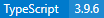
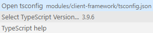
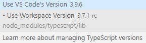
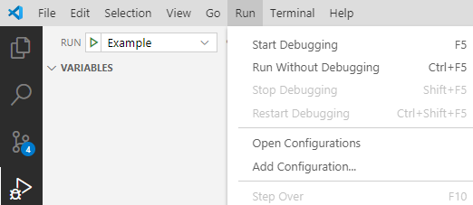
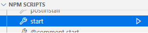

# Spire Front End

This document describes how to set up and run Spire for development.

## Setting Up

1. Have an available running instance of B2B Commerce Cloud by Insite with the exact same version as Spire.
   - It doesn't have to be on your local OS; it can be a remote server or a virtual machine, as long as it's reachable from the OS hosting Spire.
   - During development, the URL for B2B Commerce Cloud by Insite can be configured via /FrontEnd/config/settings.js (created as a copy of settings-base.js).
2. [Install node/npm](https://nodejs.org/en/) version 12 or higher.
   - If you're running B2B Commerce Cloud by Insite locally, this may already be done.
3. Run `npm install` from /FrontEnd.

Follow the instructions further down for use with [Visual Studio Code](#visual-studio-code) and [Rider/WebStorm](#riderwebstorm).

## IDE Configuration

### Visual Studio Code

1. Open the /FrontEnd directory. A launch configuration is already present so no additional steps are required to start the application.
2. (Recommended) [Install the ESLint extension from Microsoft](https://marketplace.visualstudio.com/items?itemName=dbaeumer.vscode-eslint) to see ESLint errors in the editor for auto-fix-on-save capability.
3. (Recommended) Set the TypeScript version to the workspace version to improve performance and align errors shown in the UI with those from the build.
   - Open a .ts/.tsx file and click the TypeScript version in the lower right of the screen.<br />
     
   - The top center of the screen will show options including the choice to select the TypeScript version.<br />
     
   - Choose the version of TypeScript from the workspace.<br />
     

### Rider/WebStorm

1. Open the /FrontEnd directory. A launch configuration is already present. Ctrl + F5 to start the base site.
2. (Recommended) Enable eslint file watchers for .ts and .tsx files

## Launch Spire

### From the Visual Studio Code IDE

From the debug menu, `launch.json` is read to indicate which startup configuration to use, the default is base code but you can select a different option or edit the file ot add new ones.
The Run menu or debug panel can be used to launch the site with the currently selected configuration.
Running without debugging will perform better but will not provide a debugger for server-side rendering.



Visual Studio Code also offers section in the Explorer tab to run NPM scripts via the UI.
Using the "start" option is equivalent to running the `npm run start` command via a Terminal window.



### From the Command Line

1. Run `npm run start` from /FrontEnd. This launches Spire with the default blueprint and port. NOTE: This step is already setup in Visual Studio Code and Rider as a launch configuration.
2. Navigate to http://localhost:3000.

By default, API requests are forwarded to http://commerce.local.com. You can change this URL in the /FrontEnd/config/settings.js file.

### Launch Spire with a Custom Blueprint

In addition to launching Spire with the base blueprint, you can create a custom blueprint and launch spire using that blueprint. The steps to do that are below:

1. [Create a blueprint](https://support.insitesoft.com/hc/en-us/articles/360039410011-Create-a-New-Blueprint-in-Spire).
2. Run `npm run start {customBlueprintName}` from /FrontEnd.
   - With VS Code, you can edit `launch.json` to add an IDE startup profile for custom blueprints. Other IDEs should have something similar.
3. Navigate to http://localhost:3000.

## Site Generation
The pages for a site will automatically generate the first time a request is made to the server, if there are no pages present. You can force the regeneration of the site by running the following SQL statement in your InsiteCommerce database:
```sql
DELETE FROM content.Node
```
and then loading the site again.

## Optimizing your Development Experience

- Install the React Dev Tools extension for your browser.
  - Identifies the component stack anywhere on the page.
  - Shows which components are re-rendering when props or state change, to help with performance optimization.
- Install the Redux Dev Tools extension for your browser
  - Spire uses Redux for data distribution and events and these can be monitored via this extension.
  - Spire also injects handler chain steps into this tool.

### Debugging Server-Side Rendering

By default, when a browser first accesses a Spire-hosted page, server-side rendering is initiated so the initial HTML is as complete as possible.
This can be temporarily overridden by appending `?DisableSSR` to a URL, forcing full client-side rendering and making some types of problems visible to browser dev tools.

To debug the server-side Node code, an IDE capable of Node debugging (such as Visual Studio Code or WebStorm) is required.
Spire must be started with an attached debugger. WebStorm has a configuration named "start base - debug" set up for this.
Hot replacement of server code via Webpack means that the association between the code on screen and the running code is lost; it can be re-established by using the JavaScript `debugger` command as a break point.
